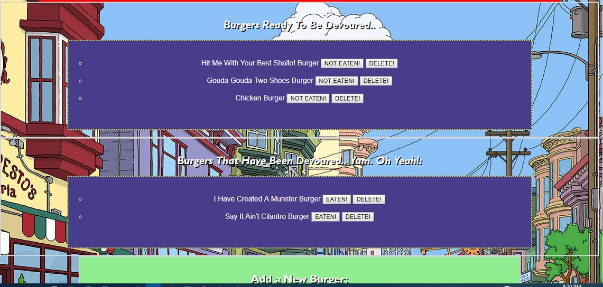
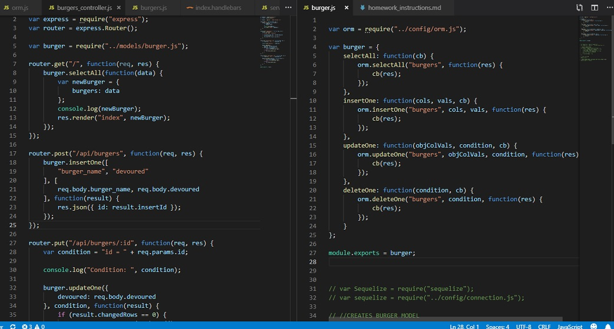
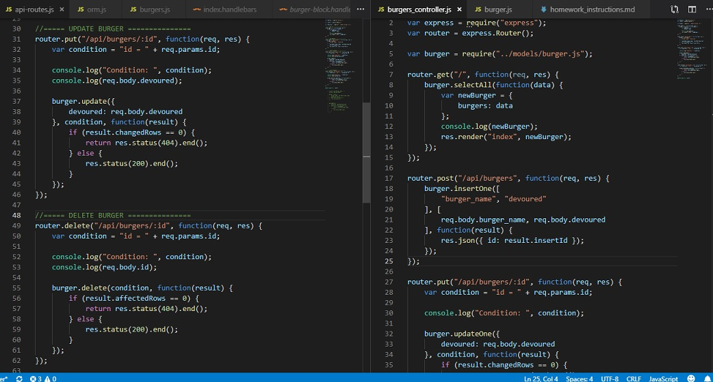

# Eat-Da-Burger!

In this project, we were asked to create a page, or burger logger, that would allow users to see a list of burgers pre-coded into a database that have yet to be devoured, the ability for the user to add any type of burger to the database, and then have a button that would devour (electronically of course) each burger and move them to the 'Eaten' part of the page.  The user would also have the opportunity to un-eat a burger to move it back to the 'yet to be devoured' part of the page, and then also the ability to delete a burger from the database also.

Creating this project the technologies used were mysql, node, express, express handlebars and ORM.  We also used the MVC design pattern to separate the server connection and configuration in a 'config' folder, a controller folder and page that would define and export our router, a database folder to hold our schema and seeds for the start of the burger database, a models folder that would bring in our ORM and create a burger variable that would hold the 'get, create, update and delete' functions, a public folder to hold our css, images and javascript files, a views folder to hold our handlebars folder (index. and main.handlebars), a routes folder for our API calls, and lastly all of the node_modules from our required installs - mysql, express and express-handlebars.

Throughout this project, using the past class examples, mainly 17-CatsApp, I was able to format the layout of the majority of the project without much trouble, but I did try to type out the pages out for the most part so that I could understand what each page and the code was doing.  After going through and setting the pages and directories up, the problems I ran into were my css page not loading even though I had thought I had the file path set up properly.  However, Aaron had shown me that the index.html page actually gets rendered from the public folder, so that I would need to link to the css page that way.  I also had to sit with Aaron after class so that my api-routes page, models burger page, and the .js burgers page would all communicate properly.  One correction that needed to be added was when rows are updated in the database on the controllers page, "changedRows" needs to be used for Update, but "affectedRows" needs to be used for Create and Delete.  Then I also had a typo in the 'name' variable for adding a new burger name, which was found out by going through the code.

After sitting with Aaron, I was able to see the path that each file would be taking, and then updating the code and making sure every variable name and function matched, and then the page was able to operate correctly.  After that, the pages needed to be styled to look better aesthetically, and also be hosted on gitHub, heroku and my portfolio page.  I had also almost gone back to 'sequelize' the page after our last classes, but that will be done for the homework due Thursday, so that will be completed then.  It is very easy to see how using sequelize will trim down some of the code, and ultimately makes everything a little easier to read and understand.